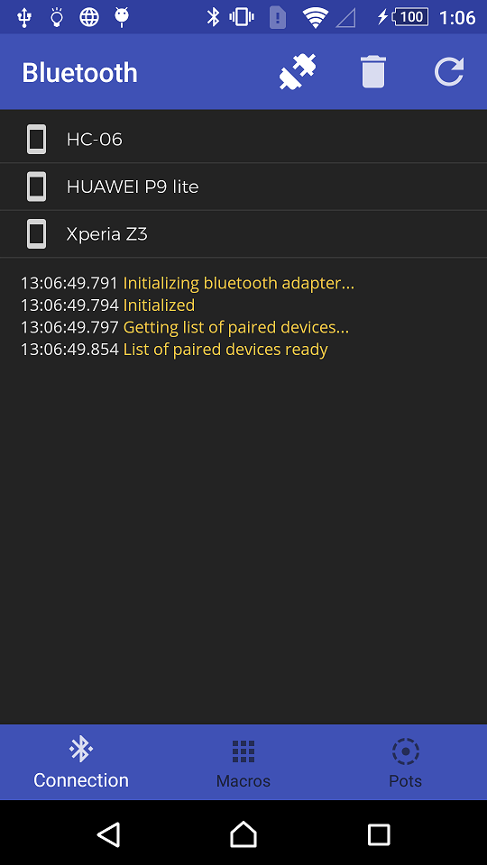
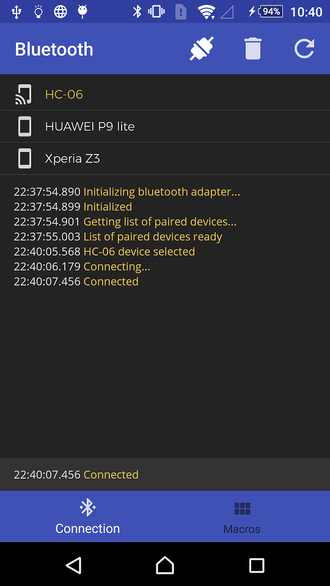
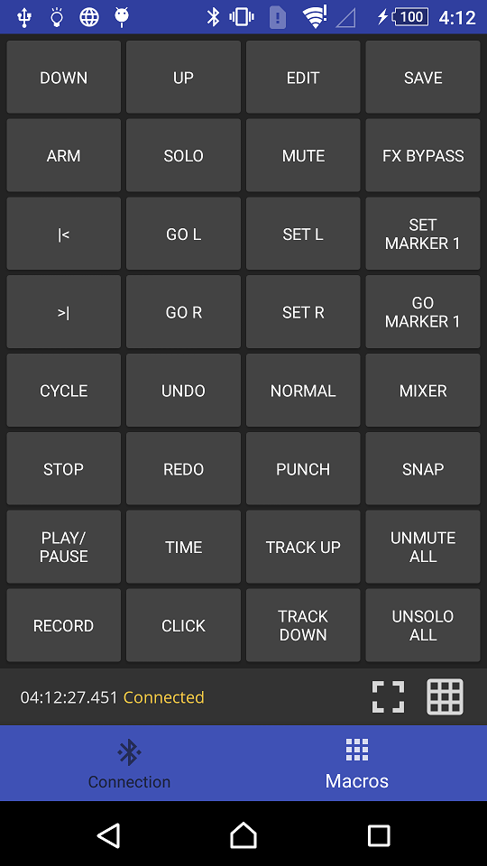
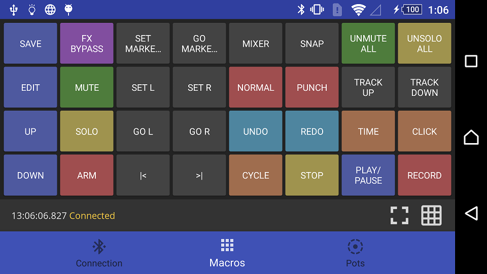
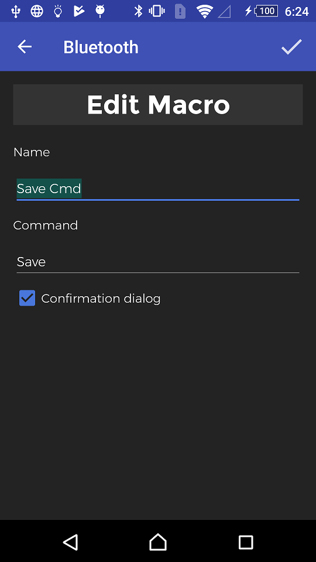
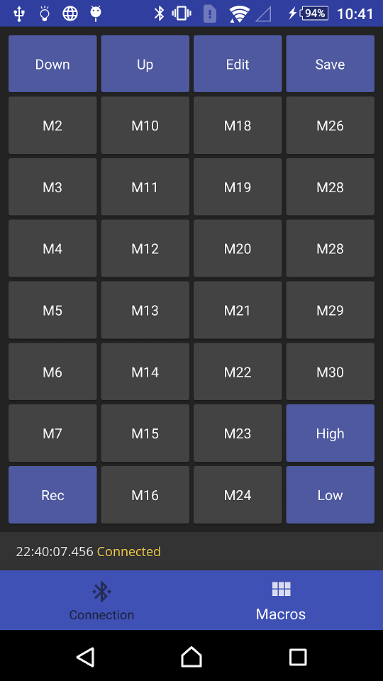
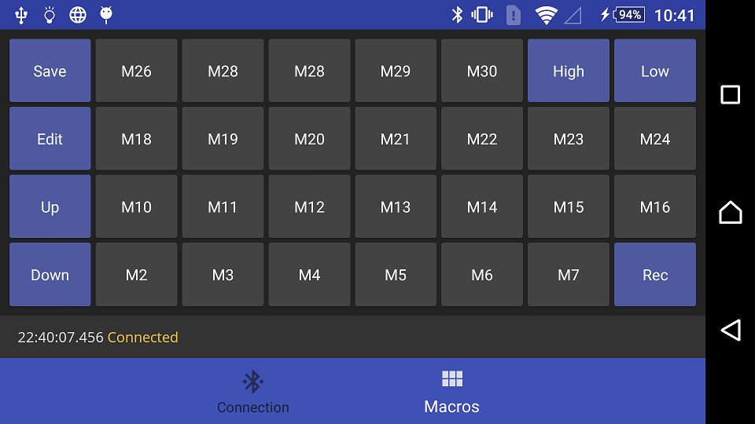

# Android Bluetooth Client for Arduino (HC-05, HC-06)

## Short description

This application is a bluetooth client used to control an Arduino project.

It provides 32 programmable macro buttons.

This application is originally designed for the Arduino project [MiminuConntroller](https://github.com/Siziksu/MiminuController), a USB MIDI controller for Arduino MEGA 2560.

## What moves this application:

- `Dagger 2` for the dependency injection.
- `Butterknife`for the view bindings.
- `RxJava` for the asynchronous calls.
- `Retrofit` as an http client.  
- `Calligraphy` for the font faces.

## Screenshots

## License
    Copyright 2018 Esteban Latre

    Licensed under the Apache License, Version 2.0 (the "License");
    you may not use this file except in compliance with the License.
    You may obtain a copy of the License at

        http://www.apache.org/licenses/LICENSE-2.0

    Unless required by applicable law or agreed to in writing, software
    distributed under the License is distributed on an "AS IS" BASIS,
    WITHOUT WARRANTIES OR CONDITIONS OF ANY KIND, either express or implied.
    See the License for the specific language governing permissions and
    limitations under the License.
